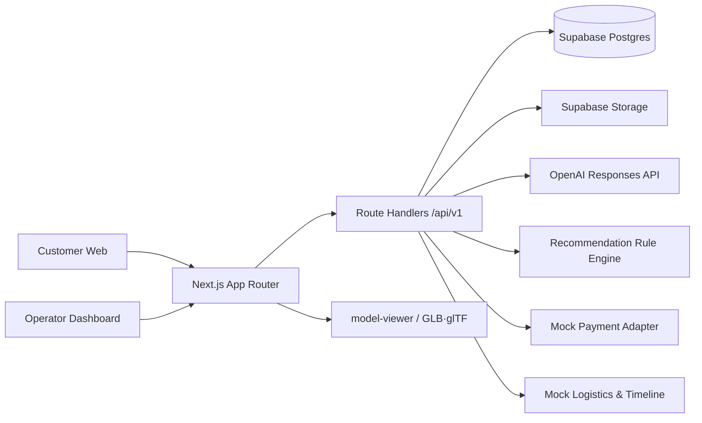
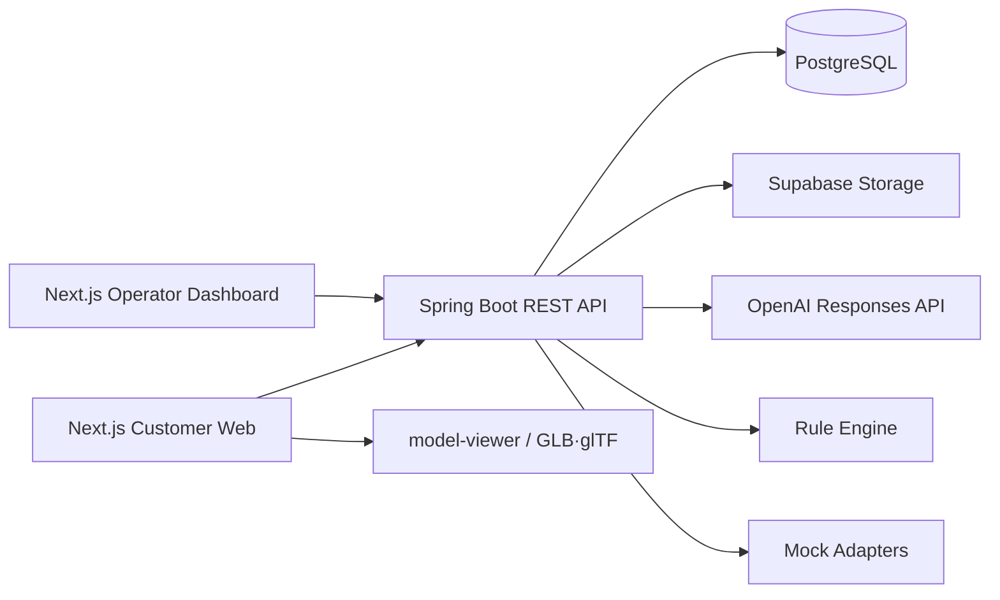
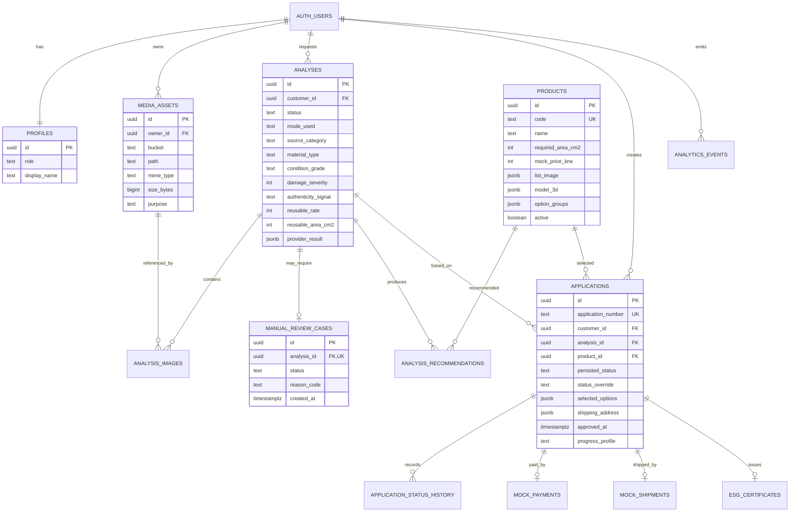

# MCM RE:BORN — 2주 해커톤 API 명세 및 개발 가이드

- 문서 버전: `1.1.0`
- 작성 기준일: `2026-08-10`
- API 계약: OpenAPI `3.1.0`
- 기준 구현: **Next.js Full-stack + Supabase + OpenAI API**
- 대안 구현: **Next.js Frontend + Spring Boot Backend**
- 서비스 성격: **Mock 데이터와 실제 멀티모달 AI를 결합한 해커톤 데모**

> 이 문서는 실제 MCM 상용 시스템, 정품 인증 시스템, 결제·택배 시스템과 연동하지 않는 해커톤용 명세다. 브랜드 자산, 제품 이미지 및 3D 모델은 사용 권한을 확인해야 하며, 데모 화면에는 “비공식 콘셉트/예상 분석”임을 명시한다.

> 2주 MVP의 단일 기준(source of truth)은 이 저장소의 `develop` 브랜치다. 별도 PRD와 유저 플로우의 장인 역할 분리, 실제 정품 검증, 실물 검수·고객 재승인, 생산 용량, 공식 A/S, 감사 및 iOS 기능은 Post-MVP / Phase 2 범위다.

---

## 1. 목표와 범위

### 1.1 한 줄 정의

고객이 보유한 MCM 가방 이미지를 업로드하면 AI가 상태를 분석하고, 재사용 가능한 원단량에 맞는 업사이클링 제품을 추천하며, 제품 상세에서 3D 결과를 확인한 뒤 Mock 주문·승인·제작 과정을 체험하는 웹 서비스다.

### 1.2 해커톤 데모의 성공 조건

다음 흐름이 중단 없이 시연되면 성공으로 본다.

```text
고객 데모 로그인
→ 원제품 사진 업로드
→ 사진 품질 확인
  ├─ 품질 미달: 원인별 안내 후 재촬영
  └─ 품질 통과: OpenAI 이미지 분석
→ `REVIEW_REQUIRED` 여부 확인
  ├─ 검토 필요: 신청 미생성·운영자 수동 검토 대기 안내
  └─ 검토 불필요: 다음 단계 진행
→ 재활용률·추천 제품 표시
→ 제품 그리드에서 완성 이미지 확인
→ 각 제품 상세에서 3D 모델 회전·확대
→ 옵션 선택 및 신청
→ Mock 결제
→ 운영자 대시보드에서 신청 승인
→ 고객 화면에서 제작 상태 자동 진행
→ Mock ESG 보증서 확인
```

### 1.3 구현 화면

#### 고객용 웹

| 화면 | 경로 예시 | 핵심 기능 |
|---|---|---|
| 데모 로그인 | `/login` | 고객 데모 계정 진입 |
| AI 스캔 | `/scan` | 사진 업로드, 촬영 가이드, 품질 미달 사유별 재촬영 안내 |
| 분석 결과 | `/analyses/{id}` | 상태, 손상, 재활용률, ESG 예상치, 정품 수동 검토 안내 |
| 추천 제품 목록 | `/products?analysisId=...` | **각 제품의 완성형 전체 이미지**를 카드/그리드로 표시 |
| 제품 상세 | `/products/{id}?analysisId=...` | **모든 제품의 GLB·glTF 3D 뷰어**, 옵션 선택 |
| 신청·Mock 결제 | `/checkout` | 주소, 동의, Mock 결제 |
| 진행 조회 | `/applications/{id}` | 승인·제작·배송 타임라인 |
| 보증서 | `/certificates/{id}` | ESG 예상 성과 및 QR 검증 정보 |

#### `OPERATOR` 통합 운영 대시보드

| 화면 | 경로 예시 | 핵심 기능 |
|---|---|---|
| 신청 목록 | `/operator/applications` | 신청 목록, 상태 필터 |
| 신청 상세 | `/operator/applications/{id}` | 고객 이미지, AI 분석, 선택 제품, 수동 검토 신호 확인 |
| 승인 | 같은 상세 화면 | `승인` 버튼 1개 |

운영 화면은 신청 목록·상세·승인에만 집중한다. 작업 상태를 직접 단계별로 수정하는 기능은 만들지 않는다.

### 1.4 제외 범위

- 실제 MCM 회원·구매이력·시리얼 DB 연동
- 실제 정품 판정 및 법적 효력이 있는 인증
- 실제 PG 결제·취소·환불
- 실제 택배사·3PL 연동
- 실측 기반 원단 수율 산정
- 공인 LCA 기반 탄소 절감량
- 3D 모델 자동 생성 또는 고객 원단의 정밀 UV 재매핑
- 장인 배정·공정별 입력·품질 체크리스트
- 복잡한 알림, 고객센터, 정산, 다국어·다통화

---

## 2. 확정된 제품 정책

### 2.1 접수 원제품

API Enum은 MCM의 가방·여행용품 사업군을 반영한다.

```text
BACKPACK
TOTE_SHOPPER
SHOULDER_CROSSBODY
BUCKET_BAG
TOP_HANDLE
BOSTON_BAG
CLUTCH_POUCH
BELT_BAG
WEEKENDER_DUFFLE
TRAVEL_LUGGAGE
UNKNOWN_BAG
```

해커톤 프롬프트·Fixture·시연 이미지는 다음 3종에 우선 최적화한다.

1. 백팩
2. 토트·쇼퍼
3. 숄더·크로스바디

신발, 향수, 주얼리, 선글라스, 스카프 등은 소재와 분석 기준이 달라 이번 분석 대상에서 제외한다.

### 2.2 결과 제품 카탈로그

| 코드 | 표시명 | 카테고리 | 필요 원단 면적 | Mock 가격 | 화면 정책 |
|---|---|---|---:|---:|---|
| `REBORN_POUCH` | RE:BORN 클러치 파우치 | 클러치·파우치 | 1,000㎠ | 280,000원 | 목록: 전체 이미지 / 상세: 3D |
| `REBORN_CARD_WALLET` | RE:BORN 카드지갑 | 카드지갑 | 300㎠ | 180,000원 | 목록: 전체 이미지 / 상세: 3D |
| `REBORN_KEYRING` | RE:BORN 키링 | 키링 | 80㎠ | 90,000원 | 목록: 전체 이미지 / 상세: 3D |

Stretch Goal:

| 코드 | 표시명 | 추가 조건 |
|---|---|---|
| `REBORN_BAG_STRAP` | RE:BORN 백 스트랩 | `longStripAvailable = true`, 600㎠ 이상 |

위 가격과 면적은 제조 근거가 없는 데모 상수다. UI에 `Demo estimate` 또는 `해커톤용 예상치`를 표시한다.

### 2.3 목록·상세 자산 계약

#### 제품 목록 카드

제품 목록은 3D 뷰어를 렌더링하지 않는다. 각 제품의 완성된 형태가 프레임 안에 모두 들어오는 `4:5` 비율의 정적 이미지를 사용한다.

```json
{
  "listImage": {
    "url": "/assets/products/reborn-pouch/list.webp",
    "alt": "RE:BORN 클러치 파우치 전체 이미지",
    "width": 1200,
    "height": 1500,
    "aspectRatio": "4:5"
  },
  "has3d": true
}
```

권장 규격:

- WebP 또는 AVIF
- 1,200×1,500px
- 제품 전체가 잘리지 않도록 중앙 배치
- 파일당 500KB 이하 권장
- 제품별 동일한 배경·카메라 각도 유지

#### 제품 상세 3D

활성 제품은 모두 `model3d`를 반드시 가진다.

```json
{
  "model3d": {
    "format": "GLB",
    "url": "/assets/models/reborn-pouch.glb",
    "posterUrl": "/assets/products/reborn-pouch/poster.webp",
    "environmentImageUrl": "/assets/3d/studio.hdr",
    "cameraOrbit": "0deg 75deg 105%",
    "cameraTarget": "0m 0m 0m",
    "fieldOfView": "30deg",
    "autoRotate": true,
    "availableVariants": [
      { "key": "BLACK_GOLD", "label": "블랙·골드" },
      { "key": "COGNAC_GOLD", "label": "코냑·골드" }
    ]
  }
}
```

권장 규격:

- 단일 파일 배포는 `GLB` 우선
- `glTF` 사용 시 외부 texture/bin 상대 경로 보존
- 제품당 8MB 이하 권장, 15MB를 상한으로 관리
- 모바일 테스트 필수
- 첫 화면에서는 poster만 표시하고 사용자 스크롤 또는 클릭 후 모델을 lazy-load
- 빌드 전 검증 스크립트에서 활성 제품의 `listImage.url`, `model3d.url`, `posterUrl` 누락 여부 검사

---

## 3. 권장 아키텍처

### 3.1 기준 구현: Next.js Full-stack



#### 선택 이유

- 고객과 운영자 화면을 한 저장소에서 개발한다.
- API DTO와 프론트엔드 TypeScript 타입을 공유할 수 있다.
- 관리자 기능이 목록·상세·승인에 불과하다.
- 결제·물류가 Mock이므로 별도 백엔드 운영 이점이 작다.
- 배포 지점을 줄여 시연 리스크를 낮춘다.

### 3.2 Spring Boot 대안



#### 적용 조건

- 팀에 Spring Boot 전담 개발자가 있다.
- 평가 항목에서 계층형 백엔드 설계가 중요하다.
- 해커톤 이후 PoC로 이어질 가능성이 높다.
- 이미 인증·예외 처리·배포 보일러플레이트가 준비되어 있다.

### 3.3 비교 요약

| 항목 | Next.js Full-stack | Next.js + Spring Boot |
|---|---|---|
| 2주 구현 속도 | 가장 유리 | 초기 설정과 배포가 추가됨 |
| 저장소 | 단일 저장소 | 프론트·백 분리 권장 |
| 타입 관리 | TypeScript 공유 | OpenAPI 코드 생성 권장 |
| CORS | 불필요하거나 단순 | 별도 설정 필요 |
| AI 호출 | Node SDK 사용이 간단 | Java SDK 또는 HTTP Client 필요 |
| 트랜잭션·도메인 계층 | 소규모에는 충분 | 복잡한 업무 규칙에 유리 |
| 배포 | Vercel 1곳 중심 | Vercel + 백엔드 런타임 |
| 해커톤 실패 지점 | 적음 | 네트워크·CORS·환경변수·DTO 동기화 증가 |
| 후속 확장 | API 계약 유지 후 교체 가능 | 장기 운영 구조에 유리 |

**최종 결정:** 이번 구현은 Next.js Full-stack을 기준으로 하며, OpenAPI 계약을 유지해 Spring Boot Controller로 교체할 수 있게 한다.

---

## 4. 모듈 구조

### 4.1 Next.js 권장 구조

현재 저장소의 Next.js 애플리케이션 루트는 `mcm-reborn/`이다. 생성된 `app/` 구조를 유지해 불필요한 이동 충돌을 피하며, 공개 자산은 `mcm-reborn/public/` 아래에 배치한다. 아래 트리는 저장소 루트 기준이다.

```text
mcm-reborn/
├── app/
│   ├── (customer)/
│   │   ├── login/
│   │   ├── scan/
│   │   ├── analyses/[analysisId]/
│   │   ├── products/
│   │   ├── products/[productId]/
│   │   ├── checkout/
│   │   └── applications/[applicationId]/
│   ├── operator/
│   │   └── applications/
│   └── api/v1/
│       ├── auth/demo-login/route.ts
│       ├── uploads/presign/route.ts
│       ├── analyses/route.ts
│       ├── analyses/[analysisId]/route.ts
│       ├── products/route.ts
│       ├── products/[productId]/route.ts
│       ├── applications/route.ts
│       ├── applications/[applicationId]/route.ts
│       ├── applications/[applicationId]/mock-payment/route.ts
│       ├── admin/applications/route.ts
│       └── admin/applications/[applicationId]/approve/route.ts
├── components/
│   ├── product/ProductCard.tsx
│   ├── product/Product3DViewer.tsx
│   └── application/ApplicationTimeline.tsx
├── server/
│   ├── auth/
│   ├── openai/
│   │   ├── OpenAiVisionProvider.ts
│   │   ├── FixtureVisionProvider.ts
│   │   └── HybridVisionProvider.ts
│   ├── recommendation/
│   │   └── calculateRecommendations.ts
│   ├── applications/
│   │   ├── applicationService.ts
│   │   └── resolveMockStatus.ts
│   ├── payments/mockPaymentAdapter.ts
│   ├── logistics/mockLogisticsAdapter.ts
│   └── repositories/
├── contracts/
│   ├── analysis.ts
│   ├── product.ts
│   ├── application.ts
│   └── errors.ts
└── lib/
    ├── supabase/
    └── openapi/
```

### 4.2 Spring Boot 대안 구조

```text
src/main/java/com/mcm/reborn/
├── api/
│   ├── AnalysisController.java
│   ├── ProductController.java
│   ├── ApplicationController.java
│   └── AdminApplicationController.java
├── application/
│   ├── AnalysisService.java
│   ├── RecommendationService.java
│   └── ApplicationService.java
├── domain/
│   ├── analysis/
│   ├── product/
│   └── application/
├── infrastructure/
│   ├── openai/
│   ├── persistence/
│   ├── storage/
│   ├── payment/mock/
│   └── logistics/mock/
└── config/
```

프론트엔드는 같은 `openapi.yaml`에서 TypeScript 클라이언트를 생성하고, Spring DTO는 동일 스키마를 기준으로 작성한다.

---

## 5. 인증과 권한

### 5.1 역할

| 역할 | 코드 | 권한 |
|---|---|---|
| 고객 | `CUSTOMER` | 본인 이미지·분석·신청·보증서 조회 및 신청 생성 |
| 운영자 | `OPERATOR` | 모든 신청 목록·상세 조회 및 승인 |

`OPERATOR`는 관리자와 장인을 합친 해커톤용 역할이다.

### 5.2 데모 로그인

`POST /api/v1/auth/demo-login`은 해커톤 전용 엔드포인트다.

```json
{
  "demoAccount": "CUSTOMER"
}
```

운영 배포에서는 이 엔드포인트를 제거하고 Supabase Auth의 정상 로그인 흐름을 사용한다.

### 5.3 보안 원칙

- OpenAI API 키는 브라우저에 노출하지 않고 서버 환경변수 `OPENAI_API_KEY`로만 사용한다.
- 개인 키를 팀원끼리 공유하지 않고 해커톤 프로젝트용 키를 분리한다.
- 원제품 사진은 private bucket에 저장한다.
- OpenAI 호출용 이미지 URL은 짧은 만료시간의 signed URL을 사용한다.
- API 응답에 Storage service-role key, OpenAI key, 내부 프롬프트를 포함하지 않는다.
- 업로드 파일 이름을 그대로 경로로 사용하지 않고 UUID를 사용한다.
- 분석·추천·신청·결제·승인처럼 신뢰가 필요한 값은 Route Handler 또는 신뢰된 서버에서만 기록한다. 브라우저가 PostgREST로 결과 필드를 직접 쓰게 하지 않는다.
- `source-products` 객체 경로는 `<auth.uid()>/<asset-id>.<ext>` 형식으로 제한하고, 고객은 자기 경로만 읽고 쓴다.
- 운영자 권한은 `profiles.role = OPERATOR`인 계정에만 부여하며, private 원본 조회와 카탈로그 자산 쓰기를 그 역할로 제한한다.

---

## 6. API 공통 규칙

### 6.1 Base URL

```text
/api/v1
```

### 6.2 공통 헤더

| 헤더 | 필수 | 설명 |
|---|---:|---|
| `Authorization: Bearer <token>` | 대부분 | Supabase access token |
| `Content-Type: application/json` | JSON 요청 | 요청 형식 |
| `X-Request-Id` | 권장 | 로그 추적용 UUID |
| `Idempotency-Key` | 생성·결제·승인 | 중복 클릭 방지용 UUID |

### 6.3 시간·통화·식별자

- 시간: ISO 8601 UTC, 예: `2026-08-04T06:30:00Z`
- 사용자 표시: `Asia/Seoul`로 변환
- 통화: `KRW`
- 금액: 정수 원 단위
- ID: UUID v4
- Enum: 영문 대문자 `SNAKE_CASE`
- API 필드: 영문 `camelCase`

### 6.4 성공 응답

단일 리소스는 리소스를 직접 반환한다. 목록은 다음 형식을 사용한다.

```json
{
  "items": [],
  "page": 0,
  "size": 20,
  "totalElements": 0,
  "totalPages": 0
}
```

### 6.5 오류 응답

```json
{
  "error": {
    "code": "APPLICATION_INVALID_STATE",
    "message": "승인 대기 상태의 신청만 승인할 수 있습니다.",
    "requestId": "9c1e6c01-a231-4ab2-a57f-50793f23df64",
    "details": {
      "currentStatus": "PENDING_PAYMENT",
      "expectedStatus": "PENDING_APPROVAL"
    }
  }
}
```

---

## 7. 전체 API 목록

| Method | Path | 인증 | 역할 | 설명 |
|---|---|---:|---|---|
| `GET` | `/health` | 아니오 | 공개 | 상태 확인 |
| `POST` | `/auth/demo-login` | 아니오 | 공개 | 데모 계정 로그인 |
| `GET` | `/me` | 예 | 공통 | 현재 사용자 |
| `POST` | `/uploads/presign` | 예 | 고객 | 이미지 업로드 URL 발급 |
| `POST` | `/analyses` | 예 | 고객 | 이미지 분석 실행 |
| `GET` | `/analyses/{analysisId}` | 예 | 고객/운영자 | 분석 결과 조회 |
| `GET` | `/products` | 예 | 고객/운영자 | 추천 제품 목록 |
| `GET` | `/products/{productId}` | 예 | 고객/운영자 | 제품 및 3D 상세 |
| `POST` | `/applications` | 예 | 고객 | 업사이클링 신청 생성 |
| `GET` | `/applications` | 예 | 고객 | 본인 신청 목록 |
| `GET` | `/applications/{applicationId}` | 예 | 고객/운영자 | 신청 상세 |
| `POST` | `/applications/{applicationId}/mock-payment` | 예 | 고객 | Mock 결제 완료 |
| `GET` | `/applications/{applicationId}/timeline` | 예 | 고객/운영자 | 계산된 공정 타임라인 |
| `GET` | `/applications/{applicationId}/shipment` | 예 | 고객/운영자 | Mock 운송장 |
| `GET` | `/applications/{applicationId}/certificate` | 예 | 고객/운영자 | ESG 보증서 |
| `GET` | `/certificates/{certificateId}/verify` | 아니오 | 공개 | 보증서 검증 페이지 데이터 |
| `GET` | `/admin/applications` | 예 | 운영자 | 신청 목록 |
| `GET` | `/admin/applications/{applicationId}` | 예 | 운영자 | 신청 상세 |
| `POST` | `/admin/applications/{applicationId}/approve` | 예 | 운영자 | 신청 승인 |
| `POST` | `/events` | 선택 | 공통 | KPI 이벤트 기록 |

정확한 스키마와 모든 응답 코드는 동봉된 `openapi.yaml`을 기준으로 한다.

---

## 8. 핵심 API 상세

## 8.1 업로드 URL 발급

### `POST /uploads/presign`

요청:

```json
{
  "files": [
    {
      "fileName": "front.jpg",
      "contentType": "image/jpeg",
      "sizeBytes": 2350234,
      "purpose": "SOURCE_PRODUCT"
    },
    {
      "fileName": "damage-closeup.jpg",
      "contentType": "image/jpeg",
      "sizeBytes": 1944012,
      "purpose": "DAMAGE_CLOSEUP"
    }
  ]
}
```

응답:

```json
{
  "assets": [
    {
      "assetId": "a814fcec-86ef-46bb-a6dd-5e189a5826ca",
      "method": "PUT",
      "uploadUrl": "https://signed-upload.example/...",
      "headers": {
        "Content-Type": "image/jpeg"
      },
      "storagePath": "source-products/user-id/uuid.jpg",
      "expiresAt": "2026-08-04T06:45:00Z"
    }
  ]
}
```

제약:

- 허용 형식: JPEG, PNG, WebP
- 파일당 최대 6MB
- 분석당 최소 1개, 권장 3개, 최대 4개
- 권장 구도: 전면, 후면, 손상 부위, 내부·시리얼 중 1개

## 8.2 AI 분석 실행

### `POST /analyses`

요청:

```json
{
  "imageAssetIds": [
    "a814fcec-86ef-46bb-a6dd-5e189a5826ca",
    "1d45245d-a534-4741-8719-f0e2200be1e7"
  ],
  "sourceCategoryHint": "TOTE_SHOPPER",
  "locale": "ko-KR",
  "demoScenarioKey": "TOTE_MODERATE_WEAR"
}
```

`demoScenarioKey`는 `AI_MODE=fixture` 또는 live 호출 실패 시 폴백 결과를 결정하는 용도다. 실제 AI 성공 시 무시할 수 있다. 단, `LOW_QUALITY_RECAPTURE`는 재촬영 오류를 재현하는 전용 시나리오다.

응답:

```json
{
  "id": "71d65a99-14bc-48b6-a58f-85043110aff1",
  "status": "COMPLETED",
  "modeUsed": "LIVE",
  "sourceProduct": {
    "category": "TOTE_SHOPPER",
    "materialType": "COATED_CANVAS",
    "confidence": 0.89
  },
  "condition": {
    "grade": "B",
    "overallDamageSeverity": 31,
    "summary": "몸판은 대체로 양호하고 손잡이와 모서리에 마모가 있습니다."
  },
  "damages": [
    {
      "type": "HANDLE_WEAR",
      "location": "TOP_HANDLE",
      "severity": 54,
      "confidence": 0.92
    },
    {
      "type": "EDGE_ABRASION",
      "location": "BOTTOM_CORNERS",
      "severity": 36,
      "confidence": 0.81
    }
  ],
  "imageQuality": {
    "status": "ACCEPTABLE",
    "issues": []
  },
  "authenticitySignal": "NOT_EVALUATED",
  "reusableMaterialRate": 65,
  "estimatedReusableAreaCm2": 2470,
  "longStripAvailable": false,
  "recommendations": [
    {
      "productId": "10000000-0000-4000-8000-000000000001",
      "productCode": "REBORN_POUCH",
      "eligible": true,
      "score": 96,
      "reasonCodes": ["SUFFICIENT_AREA", "PATTERN_VISIBILITY"]
    },
    {
      "productId": "10000000-0000-4000-8000-000000000002",
      "productCode": "REBORN_CARD_WALLET",
      "eligible": true,
      "score": 91,
      "reasonCodes": ["SUFFICIENT_AREA", "LOW_DAMAGE_REGION_AVAILABLE"]
    },
    {
      "productId": "10000000-0000-4000-8000-000000000003",
      "productCode": "REBORN_KEYRING",
      "eligible": true,
      "score": 82,
      "reasonCodes": ["USES_SMALL_REMNANTS"]
    }
  ],
  "esgPreview": {
    "methodologyVersion": "DEMO_LCA_V1",
    "estimatedCarbonSavingKgCo2e": 2.96,
    "disclaimer": "해커톤용 추정치이며 공인 ESG 수치가 아닙니다."
  },
  "provider": {
    "name": "OPENAI",
    "model": "gpt-5.6",
    "requestId": "provider-request-id"
  },
  "warnings": []
}
```

### 분석 모드

| 환경변수 | 동작 |
|---|---|
| `AI_MODE=live` | OpenAI만 호출, 실패 시 5xx |
| `AI_MODE=fixture` | OpenAI 호출 없이 Fixture 반환 |
| `AI_MODE=hybrid` | OpenAI 우선, 실패·타임아웃·파싱 오류 시 Fixture 반환 |

해커톤 시연은 `hybrid`를 사용한다. 폴백 발생 시 HTTP는 성공으로 반환하되 `modeUsed = FIXTURE_FALLBACK`, `warnings`에 원인을 담는다.

사진 품질 미달은 AI 제공자 장애가 아니므로 Fixture 성공으로 폴백하지 않는다. 성공 분석 레코드를 만들지 않고 `422 IMAGE_QUALITY_INSUFFICIENT`를 반환하며, `imageQuality.issues`에 문제 코드와 `guidanceKo`를 담아 같은 제품을 다시 촬영하게 한다.

## 8.3 추천 제품 목록

### `GET /products?analysisId={analysisId}`

응답의 `items`는 추천 점수 내림차순으로 정렬한다.

```json
{
  "items": [
    {
      "id": "10000000-0000-4000-8000-000000000001",
      "code": "REBORN_POUCH",
      "name": "RE:BORN 클러치 파우치",
      "category": "CLUTCH_POUCH",
      "mockPrice": { "amount": 280000, "currency": "KRW" },
      "requiredAreaCm2": 1000,
      "listImage": {
        "url": "/assets/products/reborn-pouch/list.webp",
        "alt": "RE:BORN 클러치 파우치 전체 이미지",
        "width": 1200,
        "height": 1500,
        "aspectRatio": "4:5"
      },
      "has3d": true,
      "recommendation": {
        "eligible": true,
        "score": 96,
        "reasonCodes": ["SUFFICIENT_AREA", "PATTERN_VISIBILITY"]
      }
    }
  ],
  "page": 0,
  "size": 20,
  "totalElements": 3,
  "totalPages": 1
}
```

## 8.4 제품 3D 상세

### `GET /products/{productId}?analysisId={analysisId}`

```json
{
  "id": "10000000-0000-4000-8000-000000000001",
  "code": "REBORN_POUCH",
  "name": "RE:BORN 클러치 파우치",
  "description": "기존 가방의 패턴 원단을 넓게 살리는 클러치형 파우치입니다.",
  "mockPrice": { "amount": 280000, "currency": "KRW" },
  "dimensions": { "widthMm": 260, "heightMm": 180, "depthMm": 45 },
  "listImage": {
    "url": "/assets/products/reborn-pouch/list.webp",
    "alt": "RE:BORN 클러치 파우치 전체 이미지",
    "width": 1200,
    "height": 1500,
    "aspectRatio": "4:5"
  },
  "model3d": {
    "format": "GLB",
    "url": "/assets/models/reborn-pouch.glb",
    "posterUrl": "/assets/products/reborn-pouch/poster.webp",
    "environmentImageUrl": "/assets/3d/studio.hdr",
    "cameraOrbit": "0deg 75deg 105%",
    "cameraTarget": "0m 0m 0m",
    "fieldOfView": "30deg",
    "autoRotate": true,
    "availableVariants": [
      { "key": "BLACK_GOLD", "label": "블랙·골드" },
      { "key": "COGNAC_GOLD", "label": "코냑·골드" }
    ]
  },
  "optionGroups": [
    {
      "key": "hardwareColor",
      "label": "금속 색상",
      "required": true,
      "options": [
        { "value": "GOLD", "label": "골드", "modelVariant": "BLACK_GOLD" },
        { "value": "SILVER", "label": "실버", "modelVariant": "BLACK_SILVER" }
      ]
    },
    {
      "key": "initials",
      "label": "이니셜",
      "required": false,
      "type": "TEXT",
      "maxLength": 3
    }
  ],
  "recommendation": {
    "eligible": true,
    "score": 96,
    "reasonCodes": ["SUFFICIENT_AREA", "PATTERN_VISIBILITY"]
  }
}
```

### React 3D 뷰어 예시

```tsx
'use client';

import '@google/model-viewer';

export function Product3DViewer({ model }: { model: Product3D }) {
  return (
    <model-viewer
      src={model.url}
      poster={model.posterUrl}
      environment-image={model.environmentImageUrl}
      camera-controls
      auto-rotate={model.autoRotate}
      camera-orbit={model.cameraOrbit}
      camera-target={model.cameraTarget}
      field-of-view={model.fieldOfView}
      interaction-prompt="auto"
      loading="lazy"
      style={{ width: '100%', height: 'min(70vh, 720px)' }}
      alt="선택한 업사이클링 제품의 3D 미리보기"
    />
  );
}
```

TypeScript JSX 타입 선언이 필요한 경우 `model-viewer.d.ts`를 추가한다.

## 8.5 신청 생성

### `POST /applications`

```json
{
  "analysisId": "71d65a99-14bc-48b6-a58f-85043110aff1",
  "productId": "10000000-0000-4000-8000-000000000001",
  "selectedOptions": {
    "hardwareColor": "GOLD",
    "liningColor": "BLACK",
    "initials": "MCM"
  },
  "shippingAddress": {
    "recipientName": "김민지",
    "phone": "010-0000-0000",
    "postalCode": "06000",
    "address1": "서울특별시 강남구 ...",
    "address2": "101호"
  },
  "consents": {
    "demoTermsAccepted": true,
    "aiEstimateNoticeAccepted": true,
    "esgEstimateNoticeAccepted": true
  }
}
```

응답:

```json
{
  "id": "79fc6fa6-9c02-4b02-ac56-c6af12c7fa29",
  "applicationNumber": "RB-20260804-0001",
  "status": "PENDING_PAYMENT",
  "amount": { "amount": 280000, "currency": "KRW" },
  "createdAt": "2026-08-04T06:30:00Z"
}
```

서버 검증:

- 분석 소유자가 현재 고객인지 확인
- 분석이 완료되었는지 확인
- `authenticitySignal = REVIEW_REQUIRED`이면 신청을 생성하지 않고 `422 AUTHENTICITY_REVIEW_REQUIRED`와 수동 검토 대기 정보를 반환
- 추천 결과에서 `eligible = true`인지 확인
- 제품이 활성 상태이고 3D 자산을 보유하는지 확인
- 옵션 값이 제품 옵션 스키마와 일치하는지 확인
- 동일 `Idempotency-Key`는 동일 신청을 반환

## 8.6 Mock 결제

### `POST /applications/{applicationId}/mock-payment`

```json
{
  "method": "DEMO_CARD",
  "simulate": "SUCCESS"
}
```

응답:

```json
{
  "paymentId": "4d69dbf2-dde8-45ef-bca3-68de5f8796b0",
  "transactionId": "MOCK-PAY-20260804-0001",
  "status": "PAID",
  "paidAmount": { "amount": 280000, "currency": "KRW" },
  "paidAt": "2026-08-04T06:32:00Z",
  "applicationStatus": "PENDING_APPROVAL"
}
```

`simulate = FAILURE`를 테스트에 사용할 수 있으나 실제 시연 UI에는 성공 버튼만 노출한다.

## 8.7 운영자 신청 승인

### `POST /admin/applications/{applicationId}/approve`

요청:

```json
{
  "note": "AI 분석과 신청 옵션 확인 완료"
}
```

응답:

```json
{
  "id": "79fc6fa6-9c02-4b02-ac56-c6af12c7fa29",
  "status": "APPROVED",
  "approvedAt": "2026-08-04T06:35:00Z",
  "approvedBy": {
    "id": "operator-user-id",
    "displayName": "MCM RE:BORN 운영자"
  },
  "mockProgressProfile": "FAST_DEMO"
}
```

승인 가능한 상태는 `PENDING_APPROVAL`뿐이다. 중복 승인은 동일 결과를 반환하거나 `409 APPROVAL_ALREADY_PROCESSED`를 반환하도록 정책을 한 가지로 고정한다. 본 명세에서는 같은 `Idempotency-Key`에는 동일 응답, 다른 키의 재승인에는 `409`를 권장한다.

---

## 9. 신청 상태 모델

### 9.1 정상 상태

```text
PENDING_PAYMENT
→ PENDING_APPROVAL
→ APPROVED
→ RECEIVING_PRODUCT
→ PRODUCT_RECEIVED
→ IN_PRODUCTION
→ QUALITY_CHECK
→ SHIPPED
→ COMPLETED
```

### 9.2 예외 상태

```text
ADDITIONAL_REVIEW_REQUIRED
PRODUCTION_UNAVAILABLE
CANCELED
```

AI는 정품 여부를 확정하지 않는다. 분석의 `authenticitySignal = REVIEW_REQUIRED`는 “추가 확인 필요” 신호일 뿐 정품 또는 가품 판정이 아니다. 이 경우 신청·결제·제작 상태로 진입하지 않고, `POST /applications`가 `422 AUTHENTICITY_REVIEW_REQUIRED`와 `manualReviewCaseId`, `PENDING`, `AWAIT_MANUAL_REVIEW`를 반환한다. 수동 검토 완료 API는 2주 MVP 범위에 포함하지 않는다.

### 9.3 상태 전이표

| 현재 상태 | 이벤트 | 다음 상태 | 주체 |
|---|---|---|---|
| `PENDING_PAYMENT` | Mock 결제 성공 | `PENDING_APPROVAL` | 고객 |
| `PENDING_APPROVAL` | 승인 | `APPROVED` | 운영자 |
| `APPROVED` | 경과시간 | `RECEIVING_PRODUCT` | Mock 엔진 |
| `RECEIVING_PRODUCT` | 경과시간 | `PRODUCT_RECEIVED` | Mock 엔진 |
| `PRODUCT_RECEIVED` | 경과시간 | `IN_PRODUCTION` | Mock 엔진 |
| `IN_PRODUCTION` | 경과시간 | `QUALITY_CHECK` | Mock 엔진 |
| `QUALITY_CHECK` | 경과시간 | `SHIPPED` | Mock 엔진 |
| `SHIPPED` | 경과시간 | `COMPLETED` | Mock 엔진 |

예외 상태는 Seed 데이터로 제공한다. 운영자 화면에 예외 전환 버튼은 만들지 않는다.

### 9.4 자동 공정 시뮬레이션

별도 Cron·Queue·Worker를 만들지 않는다. `approvedAt`과 현재 시각 차이를 기준으로 조회 시 상태를 계산한다.

`FAST_DEMO` 기준:

| 승인 후 경과 | 계산 상태 |
|---:|---|
| 0~4초 | `APPROVED` |
| 5~9초 | `RECEIVING_PRODUCT` |
| 10~19초 | `PRODUCT_RECEIVED` |
| 20~34초 | `IN_PRODUCTION` |
| 35~49초 | `QUALITY_CHECK` |
| 50~64초 | `SHIPPED` |
| 65초 이상 | `COMPLETED` |

```ts
const FAST_DEMO_STEPS = [
  { afterSeconds: 0, status: 'APPROVED' },
  { afterSeconds: 5, status: 'RECEIVING_PRODUCT' },
  { afterSeconds: 10, status: 'PRODUCT_RECEIVED' },
  { afterSeconds: 20, status: 'IN_PRODUCTION' },
  { afterSeconds: 35, status: 'QUALITY_CHECK' },
  { afterSeconds: 50, status: 'SHIPPED' },
  { afterSeconds: 65, status: 'COMPLETED' },
] as const;

export function resolveMockStatus(approvedAt: Date, now = new Date()) {
  const elapsed = Math.max(0, (now.getTime() - approvedAt.getTime()) / 1000);
  return [...FAST_DEMO_STEPS]
    .reverse()
    .find((step) => elapsed >= step.afterSeconds)!.status;
}
```

신청 조회 API는 DB의 명시적 예외 상태가 있으면 이를 우선하고, 없으면 계산된 상태를 반환한다.

```text
effectiveStatus = statusOverride ?? resolveMockStatus(approvedAt, now)
```

---

## 10. OpenAI 이미지 분석 가이드

## 10.1 역할 분리

OpenAI가 담당하는 영역:

- 이미지별 분석 가능 품질과 재촬영 사유
- 가방 카테고리 추정
- 소재 유형 추정
- 상태 등급
- 손상 유형·위치·심각도
- 긴 연속 원단 확보 가능성 추정
- 사람이 읽을 수 있는 요약

서버 규칙 엔진이 담당하는 영역:

- 재활용률
- 추정 재사용 가능 면적
- 추천 제품 적합 여부와 점수
- Mock 탄소 절감량
- 가격

AI에게 최종 추천과 ESG 수치를 맡기지 않는 이유는 데모 반복 시 결과를 안정적으로 유지하기 위해서다.

## 10.2 Structured Output 스키마

```ts
import { z } from 'zod';

const ImageQualityIssueCodeSchema = z.enum([
  'BLUR',
  'TOO_DARK',
  'TOO_BRIGHT',
  'GLARE',
  'PRODUCT_CROPPED',
  'INSUFFICIENT_DETAIL',
  'MIXED_PRODUCTS',
]);

export const BagVisionSchema = z.object({
  imageQuality: z.object({
    status: z.enum(['ACCEPTABLE', 'RECAPTURE_REQUIRED']),
    issues: z.array(z.object({
      imageIndex: z.number().int().min(0).max(3),
      code: ImageQualityIssueCodeSchema,
      guidanceKo: z.string().min(1).max(120),
    })).max(7),
  }),
  sourceCategory: z.enum([
    'BACKPACK',
    'TOTE_SHOPPER',
    'SHOULDER_CROSSBODY',
    'BUCKET_BAG',
    'TOP_HANDLE',
    'BOSTON_BAG',
    'CLUTCH_POUCH',
    'BELT_BAG',
    'WEEKENDER_DUFFLE',
    'TRAVEL_LUGGAGE',
    'UNKNOWN_BAG',
  ]),
  materialType: z.enum([
    'COATED_CANVAS',
    'LEATHER',
    'NYLON',
    'FABRIC',
    'MIXED',
    'UNKNOWN',
  ]),
  conditionGrade: z.enum(['A', 'B', 'C', 'D']),
  overallDamageSeverity: z.number().int().min(0).max(100),
  longStripAvailable: z.boolean(),
  damages: z.array(
    z.object({
      type: z.enum([
        'SURFACE_SCRATCH',
        'HANDLE_WEAR',
        'EDGE_ABRASION',
        'DISCOLORATION',
        'STAIN',
        'TEAR',
        'PEELING',
        'HARDWARE_DAMAGE',
        'OTHER',
      ]),
      location: z.string().max(80),
      severity: z.number().int().min(0).max(100),
      confidence: z.number().min(0).max(1),
    })
  ).max(8),
  confidence: z.number().min(0).max(1),
  summaryKo: z.string().max(300),
  authenticitySignal: z.enum(['NOT_EVALUATED', 'REVIEW_REQUIRED']),
});

export function assertImageQualityContract(
  result: z.infer<typeof BagVisionSchema>,
  imageCount: number,
) {
  const { status, issues } = result.imageQuality;
  if (status === 'ACCEPTABLE' && issues.length !== 0) {
    throw new Error('AI_OUTPUT_INVALID_ACCEPTABLE_WITH_ISSUES');
  }
  if (status === 'RECAPTURE_REQUIRED' && issues.length === 0) {
    throw new Error('AI_OUTPUT_INVALID_RECAPTURE_WITHOUT_ISSUES');
  }
  if (issues.some(({ imageIndex }) => imageIndex >= imageCount)) {
    throw new Error('AI_OUTPUT_INVALID_IMAGE_INDEX');
  }
}
```

Structured Output 파싱 직후 `assertImageQualityContract`를 호출한다. API 계층은 `imageIndex`를 원래 요청의 `imageAssetIds[imageIndex]`와 결합해 `assetId`, `code`, `guidanceKo` 형태의 재촬영 오류를 만든다. `ACCEPTABLE`이면 `issues`는 비어 있어야 하고, `RECAPTURE_REQUIRED`이면 하나 이상이어야 한다.

정품에 대한 확정 Enum은 만들지 않는다. `REVIEW_REQUIRED`는 신청을 차단하고 운영자 수동 검토 대기로 안내하는 신호다.

## 10.3 OpenAI Provider 예시

```ts
import OpenAI from 'openai';
import { zodTextFormat } from 'openai/helpers/zod';
import {
  assertImageQualityContract,
  BagVisionSchema,
} from '@/contracts/analysis';
import { ImageQualityInsufficientError } from '@/providers/openai-analysis';

const openai = new OpenAI({ apiKey: process.env.OPENAI_API_KEY });

export async function analyzeBagImages(imageUrls: string[]) {
  const model = process.env.OPENAI_VISION_MODEL ?? 'gpt-5.6';

  const response = await openai.responses.parse({
    model,
    store: false,
    input: [
      {
        role: 'system',
        content: [
          {
            type: 'input_text',
            text: BAG_ANALYSIS_SYSTEM_PROMPT,
          },
        ],
      },
      {
        role: 'user',
        content: [
          {
            type: 'input_text',
            text: '첨부 이미지를 하나의 동일 제품으로 보고 분석하세요.',
          },
          ...imageUrls.map((imageUrl) => ({
            type: 'input_image' as const,
            image_url: imageUrl,
            detail: 'auto' as const,
          })),
        ],
      },
    ],
    text: {
      format: zodTextFormat(BagVisionSchema, 'mcm_reborn_bag_analysis'),
    },
  });

  if (!response.output_parsed) {
    throw new Error('OPENAI_STRUCTURED_OUTPUT_EMPTY');
  }

  assertImageQualityContract(response.output_parsed, imageUrls.length);

  if (response.output_parsed.imageQuality.status === 'RECAPTURE_REQUIRED') {
    throw new ImageQualityInsufficientError(
      response.output_parsed.imageQuality.issues,
    );
  }

  return {
    result: response.output_parsed,
    model,
    providerRequestId: response.id,
  };
}
```

모델명은 코드에 여러 곳에서 하드코딩하지 않고 환경변수로 관리한다.

## 10.4 시스템 프롬프트 원칙

동봉된 `prompts/bag-analysis.system.txt`를 사용한다. 핵심 원칙은 다음과 같다.

- 사진에서 관찰할 수 있는 내용만 기술
- 동일 제품의 여러 각도로 간주
- 품질 미달 사진은 이미지 인덱스, 허용된 원인 코드, 짧은 한국어 재촬영 안내로 반환
- 모호한 경우 신뢰도를 낮춤
- 정품·가품 확정 금지, `REVIEW_REQUIRED`는 수동 검토 신호로만 사용
- 브랜드 로고만으로 제품 모델을 단정하지 않음
- 수치 범위 준수
- 한국어 요약은 300자 이하

## 10.5 Hybrid 폴백

```ts
import { isImageQualityInsufficient } from '@/providers/openai-analysis';

export async function analyzeWithFallback(input: AnalyzeInput) {
  if (process.env.AI_MODE === 'fixture') {
    return fixtureProvider.analyze(input);
  }

  try {
    return await openAiProvider.analyze(input);
  } catch (error) {
    if (isImageQualityInsufficient(error)) throw error;
    if (process.env.AI_MODE !== 'hybrid') throw error;

    const fallback = await fixtureProvider.analyze(input);
    return {
      ...fallback,
      modeUsed: 'FIXTURE_FALLBACK',
      warnings: [mapOpenAiErrorToWarning(error)],
    };
  }
}
```

`IMAGE_QUALITY_INSUFFICIENT`는 제공자 장애가 아니므로 Hybrid 폴백 대상에서 반드시 제외한다. Route Handler는 이 오류를 `422`와 자산별 재촬영 안내로 변환한다.

시연 전에 반드시 다음을 검증한다.

- API 키 사용 가능
- 프로젝트 예산·사용량 알림 설정
- 모델 접근 가능
- 3개 데모 이미지 각각 live 분석 성공
- 저품질 Fixture에서 422와 이미지별 재촬영 안내 반환
- `REVIEW_REQUIRED` 분석의 신청 생성 차단
- 네트워크 차단 상황에서 fixture 전환 성공
- 폴백 UI가 오류처럼 보이지 않고 “분석 완료”로 이어짐

---

## 11. 추천·ESG Mock 규칙

## 11.1 원제품별 기준 면적

| 원제품 | 기준 면적(㎠) |
|---|---:|
| `BACKPACK` | 4,200 |
| `TOTE_SHOPPER` | 3,800 |
| `SHOULDER_CROSSBODY` | 2,500 |
| `BUCKET_BAG` | 2,800 |
| `TOP_HANDLE` | 2,600 |
| `BOSTON_BAG` | 4,500 |
| `CLUTCH_POUCH` | 1,300 |
| `BELT_BAG` | 1,200 |
| `WEEKENDER_DUFFLE` | 5,200 |
| `TRAVEL_LUGGAGE` | 6,500 |
| `UNKNOWN_BAG` | 2,200 |

## 11.2 상태 등급 기본 재활용률

| 등급 | 기본률 |
|---|---:|
| A | 85% |
| B | 70% |
| C | 50% |
| D | 25% |

최종률:

```text
damagePenalty = min(overallDamageSeverity × 0.15, 15)
reusableMaterialRate = clamp(round(baseRate - damagePenalty), 15, 90)
estimatedReusableAreaCm2 = round(baseArea × reusableMaterialRate / 100)
```

예: 토트·쇼퍼, B 등급, 손상 심각도 31

```text
baseRate = 70
penalty = min(31 × 0.15, 15) = 4.65
reusableMaterialRate = 65
estimatedReusableArea = 3,800 × 0.65 = 2,470㎠
```

## 11.3 제품 적합성

```text
eligible = estimatedReusableAreaCm2 >= product.requiredAreaCm2
```

점수 예시:

```text
areaScore = min(60, round(estimatedArea / requiredArea × 40))
conditionScore = { A: 30, B: 25, C: 18, D: 8 }
remnantBonus = KEYRING ? 10 : 0
score = min(100, areaScore + conditionScore + remnantBonus)
```

## 11.4 탄소 절감량

```text
estimatedCarbonSavingKgCo2e = round(estimatedReusableAreaCm2 × 0.0012, 2)
methodologyVersion = DEMO_LCA_V1
```

이 계수는 공인 배출계수가 아니므로 보증서와 UI에서 다음 문구를 고정 노출한다.

```text
본 수치는 해커톤용 가상 산식에 따른 예상치이며 공식 환경 성과 또는 인증 수치가 아닙니다.
```

---

## 12. 데이터 모델

### 12.1 ERD



### 12.2 JSONB 사용 원칙

2주 MVP에서는 자주 바뀌는 제품 옵션, 3D 자산 설정, AI 원본 결과를 JSONB로 저장한다. 다음 단계로 확장할 때만 옵션·변형·자산 테이블을 정규화한다.

---

## 13. Mock 결제·물류·보증서

### 13.1 Mock 결제

- 성공 시 `PENDING_PAYMENT → PENDING_APPROVAL`
- 실제 카드 정보 입력 금지
- UI에는 가상의 `DEMO CARD •••• 4242`만 표시
- 같은 Idempotency-Key의 중복 호출은 같은 결제 반환

### 13.2 Mock 물류

승인 시 다음 값을 생성한다.

```json
{
  "carrierCode": "MCM_REBORN_DEMO",
  "carrierName": "MCM RE:BORN Demo Logistics",
  "trackingNumber": "RB202608040001",
  "trackingUrl": null
}
```

배송 상태는 신청의 계산 상태에서 파생한다.

| 신청 상태 | 배송 상태 |
|---|---|
| `APPROVED` | `PICKUP_RESERVED` |
| `RECEIVING_PRODUCT` | `PICKUP_IN_PROGRESS` |
| `PRODUCT_RECEIVED`~`QUALITY_CHECK` | `AT_WORKSHOP` |
| `SHIPPED` | `OUT_FOR_DELIVERY` |
| `COMPLETED` | `DELIVERED` |

### 13.3 ESG 보증서

`COMPLETED` 신청에 대해 보증서를 생성하거나, Seed 완료 신청에 대해 미리 생성한다.

```json
{
  "certificateId": "c4d38ff6-4512-4392-9c82-b9d3832baa4c",
  "certificateNumber": "ESG-RB-20260804-0001",
  "applicationNumber": "RB-20260804-0001",
  "sourceCategory": "TOTE_SHOPPER",
  "rebornProduct": "RE:BORN 클러치 파우치",
  "reusedMaterialRate": 65,
  "reusedAreaCm2": 2470,
  "estimatedCarbonSavingKgCo2e": 2.96,
  "methodologyVersion": "DEMO_LCA_V1",
  "issuedAt": "2026-08-04T06:40:00Z",
  "verificationCode": "MRB-8F3Q-2M7K",
  "disclaimer": "해커톤용 가상 보증서이며 법적·상업적 효력이 없습니다."
}
```

PDF 생성은 필수가 아니다. HTML 보증서 페이지에 인쇄 CSS를 적용해 브라우저의 PDF 저장 기능을 사용할 수 있다.

---

## 14. 오류 코드

| HTTP | 코드 | 상황 |
|---:|---|---|
| 400 | `VALIDATION_ERROR` | 요청 필드 오류 |
| 400 | `UNSUPPORTED_MEDIA_TYPE` | 허용하지 않는 이미지 형식 |
| 400 | `FILE_TOO_LARGE` | 6MB 초과 |
| 401 | `UNAUTHORIZED` | 인증 없음·만료 |
| 403 | `FORBIDDEN` | 역할 또는 소유권 불일치 |
| 404 | `RESOURCE_NOT_FOUND` | 리소스 없음 |
| 409 | `ANALYSIS_NOT_COMPLETED` | 완료 전 신청 |
| 409 | `PRODUCT_NOT_RECOMMENDED` | 적합하지 않은 제품 신청 |
| 409 | `APPLICATION_INVALID_STATE` | 잘못된 상태 전이 |
| 409 | `PAYMENT_ALREADY_COMPLETED` | 결제 중복 |
| 409 | `APPROVAL_ALREADY_PROCESSED` | 승인 중복 |
| 409 | `CERTIFICATE_NOT_READY` | 완료 전 보증서 요청 |
| 422 | `IMAGE_QUALITY_INSUFFICIENT` | 분석 가능한 사진 품질 미달, 재촬영 필요 |
| 422 | `AUTHENTICITY_REVIEW_REQUIRED` | 정품 판정 없이 수동 검토 대기, 신청 미생성 |
| 422 | `AI_OUTPUT_INVALID` | 구조화 결과 검증 실패 |
| 502 | `AI_PROVIDER_ERROR` | OpenAI 오류, live 모드 |
| 504 | `AI_PROVIDER_TIMEOUT` | OpenAI 시간 초과, live 모드 |
| 500 | `INTERNAL_ERROR` | 예기치 않은 오류 |

Hybrid 모드에서 OpenAI 오류 후 Fixture로 성공한 경우 5xx를 반환하지 않는다. 단, 사진 품질 미달은 제공자 오류가 아니므로 폴백하지 않고 422를 유지한다.

---

## 15. KPI 이벤트 명세

### `POST /events`

```json
{
  "eventName": "PRODUCT_DETAIL_VIEWED",
  "occurredAt": "2026-08-04T06:31:00Z",
  "sessionId": "7af665cb-a36d-46d0-8de3-25187866a16e",
  "analysisId": "71d65a99-14bc-48b6-a58f-85043110aff1",
  "productId": "10000000-0000-4000-8000-000000000001",
  "metadata": {
    "viewerType": "3D",
    "entryPoint": "RECOMMENDATION_GRID"
  }
}
```

필수 이벤트:

| 이벤트 | KPI 활용 |
|---|---|
| `ANALYSIS_STARTED` | 스캔 시작 수 |
| `ANALYSIS_COMPLETED` | 스캔 완료율 |
| `ANALYSIS_FALLBACK_USED` | AI 안정성 |
| `PRODUCT_LIST_VIEWED` | 결과 도달률 |
| `PRODUCT_DETAIL_VIEWED` | 3D 체험률 |
| `APPLICATION_CREATED` | 분석→신청 전환 |
| `MOCK_PAYMENT_COMPLETED` | 신청→결제 전환 |
| `APPLICATION_APPROVED` | 운영 처리 수 |
| `CERTIFICATE_VIEWED` | ESG 결과 확인률 |

해커톤 KPI는 실제 목표 수치가 아니라 데모 퍼널을 확인하는 용도로 사용한다.

---

## 16. Supabase 구성

### 16.1 Bucket

| Bucket | 공개 여부 | 내용 |
|---|---:|---|
| `source-products` | Private | 고객 업로드 이미지 |
| `catalog-assets` | Public | 제품 목록 이미지, poster, GLB·glTF, HDR |

`source-products` 경로:

```text
{userId}/{analysisDraftId}/{assetId}.{ext}
```

`catalog-assets` 경로:

```text
products/{productCode}/list.webp
products/{productCode}/poster.webp
models/{productCode}/model.glb
3d/studio.hdr
```

### 16.2 RLS 요약

- 고객은 본인 `analyses`, `applications`, `media_assets`만 조회
- 운영자는 `profiles.role = OPERATOR`일 때 모든 신청·분석 조회
- `products`는 인증 사용자에게 읽기 허용
- 원본 이미지는 고객 본인 및 운영자만 읽기 허용
- 고객용 생성·상태 변경은 인증·소유권 검사를 마친 Route Handler가 `service_role`로 수행하며, 고객의 직접 PostgREST 결과 쓰기는 허용하지 않음
- DB 트리거는 분석-이미지와 신청-분석의 소유자가 같은지 확인하고, `REVIEW_REQUIRED` 분석의 신청 생성을 거부
- `source-products`는 첫 경로 세그먼트가 `auth.uid()`인 객체만 고객이 읽고 쓰며, `catalog-assets` 쓰기는 운영자만 허용

동봉된 `supabase-schema.sql`에 최소 테이블·Seed·RLS·Storage 버킷 및 객체 정책 예시가 포함되어 있다.

---

## 17. 환경변수

환경변수 템플릿은 저장소 루트의 `.env.example`에서 관리한다. 로컬 애플리케이션 실행 시 이 파일을 `mcm-reborn/.env.local`로 복사한 뒤 값을 설정하며, 비밀값이 들어간 `.env.local`은 커밋하지 않는다.

```bash
# Public
NEXT_PUBLIC_SUPABASE_URL=
NEXT_PUBLIC_SUPABASE_PUBLISHABLE_KEY=
NEXT_PUBLIC_APP_URL=http://localhost:3000

# Server only
SUPABASE_SERVICE_ROLE_KEY=
OPENAI_API_KEY=
OPENAI_VISION_MODEL=gpt-5.6

# live | fixture | hybrid
AI_MODE=hybrid

# FAST_DEMO | STATIC
DEMO_TIMELINE_PROFILE=FAST_DEMO

# Demo-only switch
ENABLE_DEMO_LOGIN=true
```

`OPENAI_API_KEY`와 `SUPABASE_SERVICE_ROLE_KEY`는 `NEXT_PUBLIC_` 접두사를 사용하면 안 된다.

---

## 18. 테스트 전략

### 18.1 필수 자동 테스트

| 구분 | 테스트 |
|---|---|
| Contract | `openapi.yaml` 파싱 및 주요 endpoint 존재 검사 |
| Upload | 형식·용량·파일 수 검증 |
| AI | Structured Output 정상 파싱 |
| Image quality | 7개 품질 코드, 이미지별 안내, 품질 미달 시 422 및 분석 미생성 |
| AI fallback | 타임아웃·오류 시 Fixture 전환 |
| Rule Engine | 등급·손상도별 재활용률 계산 |
| Recommendation | 면적 임계값별 제품 추천 |
| Product Asset | 활성 제품마다 목록 이미지와 3D URL 존재 |
| Application | 추천 제품만 신청 가능, `REVIEW_REQUIRED` 분석은 신청 미생성 |
| Idempotency | 중복 신청·결제·승인 방지 |
| Authorization | 고객의 타인 데이터 접근·직접 결과 쓰기 차단, Storage 소유자 경로 검사 |
| Timeline | 0/5/10/20/35/50/65초 상태 계산 |
| Certificate | 완료 전 409, 완료 후 정상 발급 |

### 18.2 핵심 E2E 시나리오

```text
CUSTOMER 로그인
→ 3개 이미지 업로드
→ AI 분석 완료
→ 추천 목록 3개 표시
→ 모든 카드에 전체 이미지 표시
→ 카드지갑 상세에서 3D 로드
→ 신청 생성
→ Mock 결제
→ OPERATOR 로그인
→ 신청 승인
→ 고객 진행 화면에서 상태 변경 확인
→ 완료 Seed 신청의 보증서 확인
```

추가 E2E에서는 `LOW_QUALITY_RECAPTURE`가 422와 이미지별 안내를 반환하고 분석을 만들지 않는지, `CROSSBODY_HEAVY_WEAR`의 `REVIEW_REQUIRED` 분석이 422와 수동 검토 대기를 반환하며 신청·결제로 진입하지 않는지 확인한다.

### 18.3 시연 안전장치

- 데모용 이미지 3세트 로컬·Storage에 모두 준비
- 저품질 재촬영 Fixture와 수동 검토 Fixture를 별도 준비
- AI 실패 버튼 또는 환경변수로 fallback 동작 사전 점검
- 3D 모델을 CDN 실패에 대비해 Next.js `public`에도 복사 가능
- 완료 보증서 시연은 실시간 65초 대기 대신 Seed 완료 신청을 별도 제공
- 운영자 대시보드에 `PENDING_APPROVAL` 신청이 최소 1개 항상 존재

---

## 19. 2주 개발 일정

10영업일 기준이다. 팀원 수에 따라 UI·API·3D 작업을 병렬 진행한다.

| Day | 목표 | 완료 기준 |
|---:|---|---|
| 1 | 범위·계약 고정, 프로젝트 생성 | OpenAPI 초안, 라우팅, 디자인 토큰, Supabase 프로젝트 |
| 2 | DB·Auth·Seed | 고객/운영자 데모 로그인, 제품 3개 조회 |
| 3 | 이미지 업로드 | private bucket 업로드, 미리보기, 검증 |
| 4 | OpenAI 분석 | 실제 이미지 분석, Zod 파싱, 사진 품질·재촬영 분기, 로그 |
| 5 | Fixture 폴백·추천 엔진 | hybrid 모드, 재활용률·제품 추천 결과 UI |
| 6 | 제품 그리드·3D 상세 | 모든 카드 전체 이미지, 모든 상세 GLB·glTF 뷰어 |
| 7 | 신청·Mock 결제 | 신청 생성, 옵션 검증, 결제 후 승인 대기 |
| 8 | 운영자 대시보드 | 신청 목록·상세·승인, 권한 검사 |
| 9 | 자동 타임라인·보증서·KPI | 진행 조회, Mock 물류, 보증서, 이벤트 |
| 10 | QA·배포·리허설 | E2E 통과, fallback 검증, 발표 시나리오 고정 |

### 우선순위

#### P0 — 반드시 완료

- 데모 로그인
- 이미지 업로드
- 실제 OpenAI 분석 + Fixture 폴백
- 사진 품질 미달 재촬영 안내
- `REVIEW_REQUIRED` 신청 차단 및 수동 검토 대기 안내
- 추천 제품 3개
- 제품 목록 전체 이미지
- 제품 3종 상세 3D
- 신청·Mock 결제
- 신청 목록·승인
- 진행 조회

#### P1 — 시간 내 완료

- 보증서
- KPI 이벤트
- 예외 상태 Seed
- 옵션에 따른 3D material variant 변경

#### P2 — Stretch

- 백 스트랩
- 고객 이미지 대표 색상 추출 후 3D 재질 적용
- 3D 핫스팟과 손상 원단 배치 설명
- QR 코드 보증서 검증

---

## 20. 발표 데모 시나리오

### 정상 흐름

1. 고객 계정으로 로그인한다.
2. 낡은 MCM 토트백의 전면·후면·손상 부위 이미지를 업로드한다.
3. AI가 `TOTE_SHOPPER`, `B`, 손잡이 마모를 반환한다.
4. 서버가 재활용률 65%, 2,470㎠, 탄소 2.96kgCO₂e 예상치를 계산한다.
5. 추천 그리드에서 파우치·카드지갑·키링의 완성형 이미지를 모두 보여준다.
6. 제품을 하나씩 열어 모든 상세에서 3D 회전·확대가 가능함을 보여준다.
7. 파우치 옵션을 선택하고 Mock 결제를 완료한다.
8. 운영자 계정으로 전환해 신청을 승인한다.
9. 고객 화면에서 승인 후 공정 상태가 자동으로 변하는 것을 보여준다.
10. Seed 완료 신청의 ESG 보증서를 연다.

### 예외 흐름

신청 전 예외는 별도 Fixture로 보여준다.

- `LOW_QUALITY_RECAPTURE`: 품질 원인별 한국어 안내를 표시하고 재촬영 화면으로 복귀
- `CROSSBODY_HEAVY_WEAR`: `REVIEW_REQUIRED`를 정품·가품 판정으로 표시하지 않고, 신청 미생성 및 수동 검토 대기를 안내

운영자 신청 목록에는 `ADDITIONAL_REVIEW_REQUIRED`와 `PRODUCTION_UNAVAILABLE` Seed를 상태 badge와 설명으로 보여준다. `REVIEW_REQUIRED` 분석은 신청 행으로 만들지 않는다.

---

## 21. Spring Boot 전환 가이드

OpenAPI 경로는 변경하지 않는다.

| API | Next.js 구현 | Spring Boot 구현 |
|---|---|---|
| `POST /analyses` | `app/api/v1/analyses/route.ts` | `AnalysisController#create` |
| `GET /products` | `app/api/v1/products/route.ts` | `ProductController#list` |
| `POST /applications` | `app/api/v1/applications/route.ts` | `ApplicationController#create` |
| `POST /applications/{id}/mock-payment` | Route Handler | `ApplicationController#mockPayment` |
| `GET /admin/applications` | admin Route Handler | `AdminApplicationController#list` |
| `POST /admin/applications/{id}/approve` | approve Route Handler | `AdminApplicationController#approve` |

Spring Controller 예시:

```java
@RestController
@RequestMapping("/api/v1/admin/applications")
@RequiredArgsConstructor
public class AdminApplicationController {

    private final ApplicationService applicationService;

    @GetMapping
    public PageResponse<ApplicationSummaryResponse> list(
            @RequestParam(required = false) ApplicationStatus status,
            @RequestParam(defaultValue = "0") int page,
            @RequestParam(defaultValue = "20") int size) {
        return applicationService.findForOperator(status, page, size);
    }

    @PostMapping("/{applicationId}/approve")
    public ApplicationApprovalResponse approve(
            @PathVariable UUID applicationId,
            @RequestHeader("Idempotency-Key") String idempotencyKey,
            @RequestBody @Valid ApplicationApprovalRequest request,
            Authentication authentication) {
        return applicationService.approve(
                applicationId,
                authentication.getName(),
                idempotencyKey,
                request.note());
    }
}
```

Spring Boot를 선택할 경우 추가 작업:

- Supabase JWT 검증 또는 자체 Security 설정
- CORS
- Vercel 프론트와 백엔드 배포 URL 분리
- OpenAPI에서 TypeScript client 생성
- Java DTO와 JSON Enum 직렬화 일치 테스트
- 이미지 signed URL 발급용 Storage Adapter
- OpenAI Provider HTTP timeout·retry 설정

이 추가 작업이 P0 기능을 늦추지 않는 팀일 때만 해커톤 기준 구현으로 선택한다.

---

## 22. 완료 정의

다음 조건을 모두 만족해야 구현 완료로 본다.

- [ ] `openapi.yaml`에 정의된 P0 API가 동작한다.
- [ ] 고객과 운영자 데모 계정이 분리된다.
- [ ] OpenAI API 키가 클라이언트 번들에 포함되지 않는다.
- [ ] AI live 호출과 fixture fallback이 모두 검증된다.
- [ ] 사진 품질 미달은 폴백하지 않고 422와 이미지별 재촬영 안내를 반환하며 성공 분석을 만들지 않는다.
- [ ] `REVIEW_REQUIRED`는 정품·가품 판정으로 표시되지 않고 신청·결제를 차단한다.
- [ ] 제품 3종의 목록 전체 이미지가 존재한다.
- [ ] 제품 3종의 상세 3D 자산이 정상 로드된다.
- [ ] 추천되지 않은 제품 신청이 서버에서 차단된다.
- [ ] 고객은 다른 고객의 DB 행·원본 객체에 접근할 수 없고 분석·신청 결과를 PostgREST로 직접 쓸 수 없다.
- [ ] Mock 결제 후 운영자 목록에 신청이 표시된다.
- [ ] 승인 버튼은 `PENDING_APPROVAL`에서만 활성화된다.
- [ ] 승인 후 타임라인이 자동 진행된다.
- [ ] 완료 또는 Seed 완료 신청에서 보증서를 볼 수 있다.
- [ ] UI에 AI·정품·ESG 결과가 예상치임을 표시한다.
- [ ] 네트워크 또는 OpenAI 오류 상황에서도 발표 흐름이 중단되지 않는다.

---

## 23. 동봉 파일

| 파일 | 설명 |
|---|---|
| `openapi.yaml` | OpenAPI 3.1 API 계약 |
| `mock-data.json` | 제품·분석·재촬영·수동 검토·신청 Fixture |
| `supabase-schema.sql` | 최소 DB·Seed·RLS·Storage 정책 예시 |
| `.env.example` | 저장소 루트의 환경변수 템플릿. 로컬 실행 시 `mcm-reborn/.env.local`로 복사 |
| `prompts/bag-analysis.system.txt` | OpenAI 시스템 프롬프트 |
| `examples/openai-analysis.ts` | OpenAI Structured Output 예시 |
| `examples/mock-status.ts` | 자동 상태 계산 예시 |

---

## 24. 참고한 공식 문서

- OpenAI Developers — Images and vision: Responses API의 이미지 입력, 복수 이미지 입력 방식
- OpenAI Developers — Structured model outputs: Zod 기반 `responses.parse`와 JSON Schema 출력
- OpenAI Help Center — API Key Safety: 클라이언트 노출 금지, 환경변수 사용, 프로젝트 키 분리
- Next.js Documentation — Route Handlers: App Router 기반 HTTP endpoint
- Supabase Documentation — Next.js, Auth, Storage, private bucket, signed upload URL, RLS
- model-viewer Documentation — glTF·GLB 표시, camera controls, material variants
- Spring Boot Reference — `@RestController`와 Spring MVC 요청 매핑

문서 URL은 프로젝트 README의 References 절에 정리했다.
