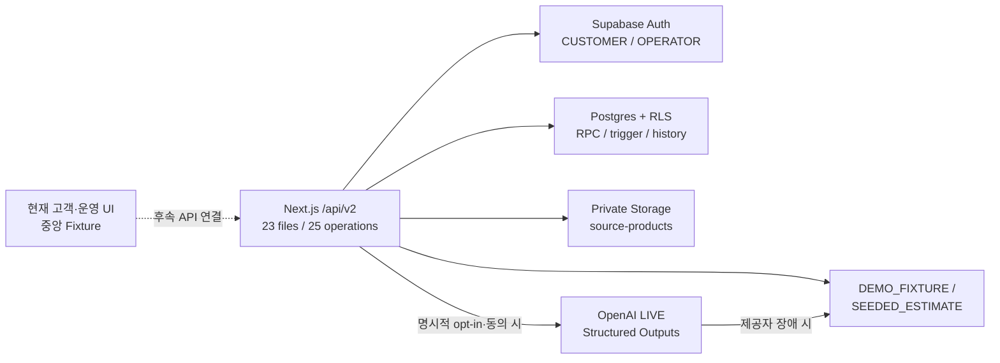

# 백엔드 v2 완성 설계 요약

> 기준일: 2026-08-19
> HTTP 계약: API `v2.0.0` / OpenAPI `3.1.0`
> 구현 브랜치: `feature-backend-v2-integration` (`origin/feature-backend`에서 분기)

이 문서는 MCM RE:BORN 데모 MVP에 적용한 백엔드 v2의 최종 구조와 현재 검증 경계를 한곳에 정리한다. 제품 의미는 [`MVP_DEMO_CANONICAL.md`](./MVP_DEMO_CANONICAL.md), 필드·상태 코드의 기계 판독 기준은 [`../openapi.yaml`](../openapi.yaml), 신규 DB 전체 구조는 [`../supabase-schema.sql`](../supabase-schema.sql)을 우선한다.

## 1. 완료 판정의 의미

백엔드 v2는 `openapi.yaml`의 **25개 API operation을 23개 Next.js Route Handler 파일과 서비스·DB 계약으로 구현**했다. GET/POST가 같은 파일에 공존하는 collection 경로 두 곳 때문에 파일 수와 operation 수가 다르다. 다만 다음 세 상태는 구분해야 한다.

| 구분 | 현재 상태 |
|---|---|
| v2 코드·계약 | 23개 Route Handler 파일·25개 API operation, 인증·검증·서비스, bootstrap과 migration/rollback 구현 |
| 고객·운영 콘솔 UI | 중앙 Fixture로 시연하며 v2 API에는 아직 연결하지 않음 |
| 외부 런타임 | 실제 Supabase 프로젝트·환경변수·migration 적용과 OpenAI LIVE 호출은 미연결·미검증 |

따라서 이 브랜치는 **v2 적용 가능한 코드 기준**이지, 실제 Supabase/OpenAI 통합 완료나 운영 준비 완료를 뜻하지 않는다. `GET /api/v2/health`가 로컬에서 `degraded`를 반환하는 것은 외부 설정이 없는 현재 환경에서 의도된 동작이다.

## 2. 전체 구조



- Route Handler는 HTTP 인증·본문 제한·Zod 검증·오류 형식을 담당한다.
- 도메인 서비스는 소유권, 상태 전이, 멱등성과 응답 조립을 담당한다.
- 고객 조회와 고객 결정은 요청 JWT를 전달한 Supabase client와 RLS를 사용한다.
- service role은 서버 안에서 인증·소유권 또는 `OPERATOR` 권한을 먼저 확인한 제한된 쓰기, 멱등성 저장과 관리 작업에만 사용한다.
- 상태 무결성과 원자성이 필요한 변경은 Postgres RPC·trigger가 최종 방어선이다.

## 3. 인증·권한·개인정보 경계

- 기본 인증은 Supabase access token의 `Authorization: Bearer <token>`이다.
- `CUSTOMER`는 자신의 분석·신청·배송·변경안·보증서만 조회하고 자신의 변경안만 결정한다.
- `OPERATOR`는 신청 목록·상세, 실물 검수와 lifecycle command를 수행한다. 별도 장인 역할은 만들지 않는다.
- 공개 경로는 health, 비활성화가 기본인 demo-login, 공개 보증서 검증처럼 OpenAPI에 명시된 예외뿐이다.
- `POST /events`는 **Bearer 인증 필수**다. 익명 이벤트를 받지 않는다.
- 이벤트 이름과 metadata key/value를 allowlist로 제한하고, 연결된 분석·제품·신청을 요청 사용자가 볼 수 있는지 확인한다. 직접 `anon`/`authenticated` DB INSERT는 회수하고 서버에서만 기록하며 사용자당 분당 제한을 적용한다.
- 응답과 로그에는 키·토큰·비밀번호·개인정보·원본 이미지 signed URL을 넣지 않는다.

## 4. 7장 업로드와 분석

분석 입력은 아래 순서의 서로 다른 자산 7개가 모두 필요하다.

```text
정면 → 후면 → 상단 → 하단 → 좌측면 → 우측면 → 일련번호
```

- 파일 형식은 JPG/JPEG·PNG, 파일당 최대 10 MiB다.
- Presign 요청은 점진 업로드를 위해 한 번에 1~4개를 받지만, 분석 생성은 정확히 7개를 요구한다.
- 원본은 private `source-products` bucket의 `<사용자 UUID>/<asset UUID>.<확장자>` 경로에 둔다.
- 서버가 먼저 소유 고객의 `PENDING` `media_assets` metadata를 예약하고, 고객 JWT로 matching object의 signed upload URL을 발급한다.
- Storage INSERT는 같은 경로의 소유자 `PENDING` metadata가 있어야 허용한다. 삭제는 소유자의 `PENDING` 자산이면서 `analysis_images`에 연결되지 않은 경우만 허용한다.
- 분석 생성 시 소유권·상태·MIME·크기·중복·순서를 다시 확인하고 실제 Storage object 존재 여부를 점검한다.
- 이미지 품질 미달은 `422 IMAGE_QUALITY_INSUFFICIENT`와 이미지별 재촬영 안내를 반환하며 성공 분석이나 Fixture 성공으로 바꾸지 않는다.

분석 결과는 사진에서 관찰한 상태와 규칙 기반 예상치를 분리한다. AI가 상태·손상 후보·신뢰도를 반환하고, 앱 규칙이 예상 재활용률·면적·추천·ESG 미리보기를 계산하거나 canonical Fixture 값을 적용한다. 정품 사전 적합도는 주문 참고 신호일 뿐 공식 정품 판정이 아니다.

## 5. 분석 모드와 외부 AI gate

| `AI_MODE` | 동작 |
|---|---|
| `DEMO_FIXTURE` | 중앙 시나리오의 검증된 고정 결과 |
| `SEEDED_ESTIMATE` | 동일 계약을 사용하는 재현 가능한 예상 결과 |
| `LIVE` | OpenAI 분석을 우선하고 제공자 장애 시 `DEMO_FIXTURE`로 폴백 |

`LIVE` 구현은 공식 OpenAI JavaScript SDK의 `chat.completions.parse`와 Zod `zodResponseFormat`을 사용하는 **Chat Completions Structured Outputs**다. 이미지 품질 실패는 제공자 장애가 아니므로 hybrid 폴백하지 않는다.

고객의 private 이미지를 외부 AI로 보내려면 아래 조건을 모두 만족해야 한다.

1. 배포 환경의 `ENABLE_EXTERNAL_AI=true`
2. 고정된 `EXTERNAL_AI_PRIVACY_NOTICE_VERSION`
3. 서버 전용 OpenAI key와 model 설정
4. 분석 요청의 명시적 외부 AI 처리 동의와 동일한 privacy notice version
5. 외부 전송 전 동의 증적 저장, 분석 완료 후 생성된 `analysis_id` 연결

동의 증적은 고객이 읽을 수 있고 서버만 쓸 수 있는 `analysis_external_ai_consents`에 보존한다. `analysis_id` 연결은 같은 고객의 `COMPLETED` 분석에 `NULL → UUID`로 한 번만 허용하고, 연결된 분석 삭제로 증적이 사라지지 않도록 FK는 `ON DELETE RESTRICT`다. 현재 브라우저 데모는 `DEMO_FIXTURE`를 사용하므로 외부 이미지 전송이 필요 없다. 실제 LIVE 호출과 동의 증적의 원격 DB 동작은 staging에서 별도 검증해야 한다.

## 6. 추천·제품 계약

- `ORDER_ELIGIBLE` 분석만 활성 제품 추천으로 진행하고 `INELIGIBLE`이면 추천 목록을 비운다.
- 추천 점수와 사유는 분석 예상 면적·제품 필요 면적·상태와 canonical Fixture를 사용한다.
- 신청 시 `selectedOptions`는 제품의 `optionGroups`에 정의된 key/value/길이만 허용한다.
- 여권지갑의 canonical option은 `edgeColor=COGNAC`, `initials=MCM`과 호환된다.
- 네 제품의 Product3D JSON 계약은 DB와 canonical Mock에 보존하지만 실제 GLB/poster 자산이 준비되지 않았으므로 `model_3d_ready`/`model3dReady=false`다. 제품 API는 준비 전 `has3d=false`, `model3d=null`로 응답하고 Mock 소비자도 readiness를 우선하며, 현재 UI는 정적 다각도 목업을 사용한다.

## 7. 신청·Mock 결제

- 신청 생성은 완료된 `ORDER_ELIGIBLE` 분석, 활성 제품, 유효한 옵션, 수거 일정과 세 필수 동의를 검증한다.
- 고객별 분석 하나로 신청 하나만 만들 수 있도록 `applications.analysis_id`를 unique로 보호한다.
- 생성 상태는 `PENDING_PAYMENT`다.
- Mock 결제 성공은 결제와 신청 상태를 원자적으로 `PAID`·`ORDER_PLACED`로 바꾼다. 대상 신청이 `PENDING_PAYMENT`가 아니거나 상태 갱신이 0행이면 결제 행까지 롤백한다.
- 실제 결제사 연동은 없으며 금액·환불은 데모 데이터다.

## 8. 주문 후 실물 검수와 변경 승인

공식 장인 검수는 주문 전 승인 게이트가 아니라 `PRODUCT_RECEIVED → EXPERT_INSPECTION` 뒤에만 수행한다.

- `NO_CHANGE` → `PRODUCTION_READY`
- `CHANGE_REQUIRED` → 검수·`PENDING` 변경안·`CHANGE_APPROVAL_REQUIRED` 상태·이력을 `submit_physical_inspection` RPC 한 트랜잭션으로 생성
- `PRODUCTION_UNAVAILABLE` → 제작 불가 상태를 기록한 뒤 허용된 명령으로 `CANCELED`

고객 변경 승인·거절은 `auth.uid()`·신청 소유권·현재 신청 상태·변경안 `PENDING`을 `SECURITY DEFINER` trigger 안에서 다시 확인하는 one-shot 결정이다. 승인하면 제안 조건을 `final_terms`로 확정하고 `PRODUCTION_READY`, 거절하면 `CANCELED`가 된다. 결정 후 `response_reason`을 다시 수정할 수 없다.

## 9. Lifecycle·배송·보증서

운영자 전용 lifecycle command는 아래 인접 전이만 허용한다.

```text
ORDER_PLACED → PICKUP_SCHEDULED → PICKUP_IN_PROGRESS
→ PRODUCT_RECEIVED → EXPERT_INSPECTION

PRODUCTION_READY → IN_PRODUCTION → QUALITY_CHECK
→ SHIPPED → DELIVERED → COMPLETED
```

- `PRODUCTION_READY`와 `CHANGE_APPROVAL_REQUIRED`는 lifecycle command가 아니라 검수·고객 결정 경로만 만든다.
- 건너뛰기·역행·guard 미충족은 `409`이며 이력을 만들지 않는다.
- `SHIPPED` 전환은 운송장을 같은 RPC에서 생성하고 canonical 배송 Fixture를 반환한다.
- 공정 중 제작 불가는 `IN_PRODUCTION` 또는 `QUALITY_CHECK`에서 `PRODUCTION_UNAVAILABLE`, 그다음 `CANCELED`만 허용한다.
- 보증서는 `COMPLETED` 신청에만 만들 수 있다. Route Handler 확인과 별개로 DB trigger가 조기 생성을 차단한다.
- 공개 보증서 검증은 데모 진위 확인이며 법적 보증이나 공인 ESG 증빙이 아니다.

## 10. 멱등성과 실패 복구

생성·결제·lifecycle·검수·변경 결정은 `Idempotency-Key`를 요구한다.

- 내부 저장 키는 `사용자 + operation + 외부 키`를 SHA-256으로 namespace해 다른 사용자·operation 충돌을 막는다.
- 같은 키와 같은 정규화 요청은 최초 성공 응답을 반환한다.
- 같은 키를 다른 payload에 재사용하면 `409`다.
- 도메인 변경이 완료된 뒤 응답 cache 저장만 실패하면 성공 결과를 실패로 가장하지 않는다.
- 분석은 예약에 `resource_id`를 연결해 완료 행을 재조회할 수 있다.
- DB RPC가 맡는 상태 전이는 상태 변경과 이력을 한 트랜잭션으로 처리한다.

프로세스 강제 종료와 동시 재시도까지 포함한 멱등성 복구는 실제 Postgres에서 부하·장애 주입 검증이 필요하다.

## 11. 구현된 HTTP 범위 — 25 operations

모든 실제 URL에는 `/api/v2` 접두사가 붙는다.

| 영역 | operations | 수 |
|---|---|---:|
| 시스템·인증 | `GET /health`, `POST /auth/demo-login`, `GET /me` | 3 |
| 업로드 | `POST /uploads/presign` | 1 |
| 분석 | `POST /analyses`, `GET /analyses`, `GET /analyses/{analysisId}` | 3 |
| 제품 | `GET /products`, `GET /products/{productId}` | 2 |
| 신청 | `POST /applications`, `GET /applications`, `GET /applications/{applicationId}` | 3 |
| 주문 조회 | `GET /applications/{applicationId}/timeline`, `GET /applications/{applicationId}/shipment` | 2 |
| 결제·보증서 | `POST /applications/{applicationId}/mock-payment`, `GET /applications/{applicationId}/certificate`, `GET /certificates/{certificateId}/verify` | 3 |
| 운영자 | `GET /admin/applications`, `GET /admin/applications/{applicationId}`, `POST /admin/applications/{applicationId}/lifecycle-commands`, `POST /admin/applications/{applicationId}/inspection` | 4 |
| 변경 승인 | `GET /applications/{applicationId}/change-request`, `POST .../approve`, `POST .../reject` | 3 |
| 분석 이벤트 | `POST /events` | 1 |
| 합계 |  | **25** |

`/api/v1` Route Handler는 현재 v2 상태·권한·DB 의미와 호환되지 않아 이 브랜치에서 제거했다. 호환 shim이나 v1/v2 동시 운영은 제공하지 않는다.

## 12. DB 적용과 롤백

### 신규·빈 staging

루트 `supabase-schema.sql`을 한 번 적용한다. 이 파일이 최종 v2 bootstrap이므로 migration 001~004를 다시 실행하지 않는다.

### 호환되는 기존 v2 데모 DB

아래 순서를 모두 적용한다.

```text
202608180001_lifecycle_integrity.sql
→ 202608180002_capture_four_views.sql
→ 202608180003_capture_seven_views.sql
→ 202608180004_backend_v2_runtime.sql
```

004는 Product3D readiness, 결제 zero-row abort, 고객 변경 결정 보안, 이벤트 server-only insert, Storage metadata binding, LIVE 동의 증적, 신청/terms/제품 옵션 제약을 보완한다. 롤백은 쓰기를 중지한 뒤 `004 → 003 → 002 → 001` 역순으로 수행한다. migration 이후 데이터나 보호 정의가 바뀌었으면 rollback은 덮어쓰지 않고 중단한다.

### 지원하지 않는 경로

`origin/feature-backend`의 v1 DB는 테이블·컬럼·enum·주문 승인 의미가 달라 위 migration의 입력으로 지원하지 않는다. 보존할 데이터가 있으면 백업 실물을 분석해 별도 v1→v2 변환 migration을 설계해야 한다. 데모 데이터만 있는 경우 신규·빈 v2 staging bootstrap이 기본 적용 경로다.

## 13. 실제 연결 완료 조건과 남은 제한

다음 항목이 모두 확인돼야 “Supabase/OpenAI 연동 완료”라고 말할 수 있다.

- 실제 staging 환경변수와 CUSTOMER·OPERATOR Auth/profile 준비
- bootstrap 또는 호환 v2 migration 001→004 실제 적용·롤백 기록
- `health.status=ok`
- Customer 간 격리, Operator 권한, private Storage와 signed upload 검증
- 7장 분석→신청→Mock 결제→수거→검수→변경 승인→제작→배송→완료→보증서 전체 호출
- 동일·충돌 멱등 요청과 RPC 원자성 검증
- `LIVE` opt-in·notice·요청 동의·증적 저장과 OpenAI 성공/장애 폴백 검증

현재 작업 환경에는 실제 Supabase URL/key, `.env.local`, CLI link, migration 적용 로그와 OpenAI 호출 증거가 없다. 자동 API 통합 테스트와 disposable Supabase runtime도 없다. lint·typecheck·build·정적 계약 검증 성공은 이 원격 통합 검증을 대신하지 않는다.
