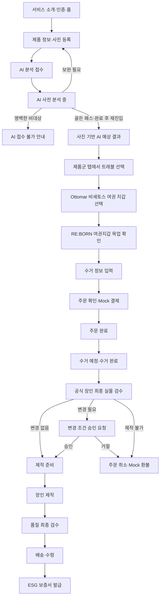

# MCM RE:BORN 데모 MVP Canonical 기준

> 기준일: 2026-08-18
>
> 상태: 현재 제품·데모 흐름의 단일 기준(SSOT)
> 적용 범위: 고객 웹 데모, Mock/Fixture, HTTP·DB 상태 모델, 발표 시나리오

## 1. 문서 우선순위

충돌이 있으면 다음 순서로 판단한다.

1. 사용자의 2026-08-18 최신 UI 지시
   - 하단 내비게이션은 `신청 내역`·`홈`·`마이페이지` 3개이며 `진행조회`를 사용자 표기로 사용하지 않는다.
   - 홈은 Figma `220:65`의 실제 영상과 `222:81` CTA를 사용한다.
   - `/orders`는 신청 목록이고, 상품을 선택하면 Figma `261:63` 기준의 `/orders/demo` 상세가 열린다.
2. 사용자의 2026-08-17 최종 원칙
   - 이 MVP는 핵심 기술 검증보다 서비스 시연과 데모 완주가 목적이다.
   - 실제 AI가 안정적으로 판단하기 어려운 값은 고정 Fixture 또는 재현 가능한 예상치로 제공할 수 있다.
   - AI 사전 판단으로 주문·Mock 결제까지 진행하고, 공식 장인 실물 검수는 주문 후 수거된 제품의 마지막 제작 조건 점검으로 수행한다.
3. `MCM RE_BORN MVP_유저플로우_2026-08-13.md`의 화면·분기 순서
4. `와이어프레임.html`의 화면 필드·CTA·콘텐츠 구조
5. `MCM RE_BORN MVP_PRD_2026-08-13.md`와 기능명세서의 업무 의미·데이터 요구
6. 저장소의 OpenAPI·Mock·DB·기존 문서와 구현

이 파일보다 이전의 결정과 보고서는 삭제하지 않는다. 다만 충돌하는 내용에는 `2026-08-17 기준 superseded/historical`을 표시하고 현재 구현·검증에는 이 문서를 사용한다.

## 2. 데모 원칙

- 골든 패스는 실제 촬영 또는 준비된 예시 사진에서 시작해 보증서까지 중단 없이 완주한다.
- AI 화면의 상태 등급, 정품 사전 적합도, 예상 재활용률, 손상·오염, 추천 사유는 중앙 데모 시나리오에서 가져온다.
- 예상치는 화면마다 다시 무작위 생성하지 않는다. `submissionId` 또는 고정 시나리오 키로 재현 가능해야 한다.
- 고객에게는 `사진 기반 AI 예상치`와 `주문 후 공식 장인 실물 검수에서 변경될 수 있음`을 함께 표시한다.
- 주문 전에는 `제작 가능 확정`, `정품 확정`, `확정 견적`이라고 표현하지 않는다.
- 실제 결제·물류·정품 인증·탄소 검증·법적 보증으로 오해할 표현을 사용하지 않는다.
- 실제 AI·3D·외부 제공자가 실패해도 Fixture와 정적 자산으로 같은 흐름을 완주한다.

### 현행 웹 구현 경계

- `/`와 `/intro`는 서비스 소개를, `/home`은 홈을 렌더한다.
- 공통 하단 내비게이션은 `신청 내역`(`/orders`)·`홈`(`/home`)·`마이페이지`(`/mypage`) 3개다. `/orders`에서 신청 상품을 선택하면 `/orders/demo` 상세가 열린다.
- 홈 hero는 준비된 실제 영상을 muted·loop·inline 방식으로 재생하고, `상품 진단하기` CTA로 제품 등록을 시작한다.
- 실제 브라우저 카메라와 파일 선택 폴백은 구현되어 있다. 촬영 Blob과 입력은 클라이언트 세션 메모리에 있으므로 전체 새로고침 뒤에는 준비된 데모 자산으로 복구한다.
- AI 분석·이미지 품질 판정·고객 인증·주문·결제·검수·보증서는 중앙 Fixture와 화면 상태로 시연한다. 운영자 lifecycle command만 `mcm-reborn/app/api/v2/` Route Handler와 Supabase RPC 연동이 있고 나머지 고객 여정은 영속 저장이 없다.
- HTTP 기준은 API 계약 v2.0.0이며 `openapi.yaml`은 OpenAPI 3.1.0 형식이다. lifecycle command 외 OpenAPI·Mock·SQL은 현재 브라우저 앱의 실행 서버가 아니라 향후 연동 기준이다.

## 3. 중앙 데모 시나리오

모든 화면, API example, Mock, DB seed와 발표 스크립트는 아래 값을 공유한다.

| 항목 | Canonical 값 |
|---|---|
| 시나리오 키 | `MCM_BACKPACK_CHANGE_APPROVED_20260817` |
| 원제품 | MCM 비세토스 모노그램 백팩 |
| 구매 연도·사용 기간 | 2019년 · 5년 이상 |
| 희망 제품 | RE:BORN 여권지갑 |
| 접수 번호 | `SUB-RB-20260817-0001` |
| 주문 번호 | `RB-20260817-0001` |
| AI 예상 재활용 가능률 | 72% |
| 정품 사전 적합도 예상 | 91% |
| 정품 문구 | 주문 적합 신호이며 MCM 정품 확정이 아님 |
| 최초 예상 제작비 | 180,000원 |
| 수거비 | 무료 |
| 주문 후 실물 검수 | `CHANGE_REQUIRED` |
| 변경 사유 | 사진에서 보이지 않던 내부 원단 손상 확인 |
| 변경 재활용률 | 68% |
| 변경 제작비 | 195,000원 |
| 변경 예상 기간 | 4~5주 |
| 고객 결정 | 변경 조건 승인 |
| Mock 배송 | `DEMO-RB-20260817-0001` · `DELIVERED` |
| 최종 보증서 번호 | `ESG-RB-20260817-0001` |
| 최종 재활용률 | 68% |
| 예상 탄소 절감량 | 3.43kg CO2e |

접수·주문·보증서는 서로 다른 도메인 식별자를 사용하지만 같은 시나리오를 가리켜야 한다. 제품명, 금액, 날짜, 재활용률과 주문 번호를 화면별 상수로 중복 정의하지 않는다.

## 4. 제품 등록 요구사항

### 사진

- 필수 슬롯: `좌측면`, `우측면`, `하단`, `후면`
- 슬롯별 1장, 총 4장 모두 필수
- 허용 형식: JPG/JPEG, PNG
- 파일당 최대 10MB
- 모바일에서는 후면 카메라를 우선 열고 촬영 후 미리보기·재촬영·사용 선택을 제공한다.
- 권한 거부·카메라 미지원·장치 없음에는 앨범/기기 파일 선택 폴백을 제공한다.
- 시리얼 번호는 사진 슬롯명이 아니라 별도 선택 입력이다.

### 제품 정보

| 필드 | 필수 여부 | 데모 기본값 |
|---|---|---|
| 제품 카테고리 | 필수 | 가방 |
| 구매 시기 | 필수 | 2019 |
| 주요 사용 기간 | 필수 | 5년 이상 |
| 희망 업사이클링 용도 | 필수 | RE:BORN 여권지갑 |
| 제품 시리얼 번호 | 선택 | 빈 값 가능 |
| 현재 상태 메모 | 선택 | 모서리 마모, 내부 변색 |

카메라 화면을 왕복해도 사진과 제품 정보는 유지한다. 필수 사진·정보가 준비되기 전에는 `AI 분석 접수하기` CTA를 비활성화하고 남은 조건을 구체적으로 안내한다.

## 5. Canonical 고객 흐름



공식 장인 실물 검수는 주문·결제 전 승인 게이트가 아니다. `ORDER_PLACED` 후 제품이 수거되고 `PRODUCT_RECEIVED`가 된 다음에만 나타난다. 제작 후 `QUALITY_CHECK`는 완성품 QA이며 AI 판단을 다시 승인하는 단계가 아니다.

## 6. 상태 모델

### 접수·분석

```text
DRAFT
READY_TO_SUBMIT
SUBMITTED
AI_ANALYZING
SUPPLEMENT_REQUIRED
AI_COMPLETED
AI_INELIGIBLE
FAILED
```

화면의 접수 상태와 OpenAPI 분석 리소스 상태는 다음처럼 명시적으로 매핑한다. 화면용 상태를 API enum으로 오인해 새 계약을 추가하지 않는다.

| 화면 상태 | OpenAPI `AnalysisStatus` | 추가 판정 |
| --- | --- | --- |
| `SUBMITTED` | `RECEIVED` | 없음 |
| `AI_ANALYZING` | `ANALYZING` | 없음 |
| `SUPPLEMENT_REQUIRED` | `SUPPLEMENT_REQUIRED` | 없음 |
| `AI_COMPLETED` | `COMPLETED` | `authenticityPrecheck.status = ORDER_ELIGIBLE` |
| `AI_INELIGIBLE` | `COMPLETED` | `authenticityPrecheck.status = INELIGIBLE` |
| `FAILED` | `FAILED` | 없음 |

### 주문·제작

```text
PENDING_PAYMENT
ORDER_PLACED
PICKUP_SCHEDULED
PICKUP_IN_PROGRESS
PRODUCT_RECEIVED
EXPERT_INSPECTION
CHANGE_APPROVAL_REQUIRED
PRODUCTION_READY
IN_PRODUCTION
QUALITY_CHECK
SHIPPED
DELIVERED
COMPLETED
PRODUCTION_UNAVAILABLE
CANCELED
```

### 검수 결정

```text
InspectionResult = NO_CHANGE | CHANGE_REQUIRED | PRODUCTION_UNAVAILABLE
ChangeDecision = PENDING | APPROVED | REJECTED
AnalysisMode = DEMO_FIXTURE | SEEDED_ESTIMATE | LIVE
```

골든 패스 전이는 다음과 같다.

```text
SUBMITTED → AI_ANALYZING → AI_COMPLETED
PENDING_PAYMENT → ORDER_PLACED → PICKUP_SCHEDULED → PICKUP_IN_PROGRESS
→ PRODUCT_RECEIVED → EXPERT_INSPECTION → CHANGE_APPROVAL_REQUIRED
→ PRODUCTION_READY → IN_PRODUCTION → QUALITY_CHECK
→ SHIPPED → DELIVERED → COMPLETED
```

향후 HTTP/DB 연동에서 수거·제작·품질·배송 상태는 운영자 전용 멱등 lifecycle command로 인접한 다음 상태만 진행한다. `PRODUCTION_READY`와 `CHANGE_APPROVAL_REQUIRED`는 실물 검수·고객 결정 경로만 만들 수 있다. 공정 중 제작 불가는 `IN_PRODUCTION` 또는 `QUALITY_CHECK`에서 `PRODUCTION_UNAVAILABLE`로 기록한 뒤 `CANCELED`로 마감한다. `CHANGE_REQUIRED` 검수는 `proposedTerms`가 필수이며 검수·변경안·상태 이력을 한 트랜잭션으로 저장한다.

기존의 주문 전 `PENDING_APPROVAL → APPROVED` 운영자 승인이나 `REVIEW_REQUIRED` 수동 검토에 의한 신청 차단은 2026-08-17 현재 데모의 골든 패스가 아니다. 과거 계약 호환이 필요하면 historical 상태로만 해석하고 새 사용자 카피에 노출하지 않는다.

## 7. AI·정품·제작 조건 카피

### 사용해야 하는 표현

- `사진 기반 AI 예상 재활용률 72%`
- `정품 사전 적합도 예상 91%`
- `주문 진행에 참고하는 AI 신호이며 정품을 확정하지 않습니다.`
- `제작 범위·비용·기간은 주문 후 수거된 실물의 공식 장인 검수에서 변경될 수 있습니다.`
- `실물 검수 결과 변경 조건이 있어 고객 승인을 기다리고 있습니다.`

### 사용하지 않는 표현

- `AI 정품 인증 완료`
- `제작 가능 확정`
- `원단 재활용 확정`
- `최종 견적`(실물 검수 전)
- `장인 승인 후 주문 가능`
- `수동 검토가 끝날 때까지 주문 불가`(골든 패스)

## 8. 데모 구현 규칙

- 실제 촬영 이미지는 등록 미리보기와 원제품 썸네일에 사용한다.
- 분석 숫자는 촬영 이미지 자체에서 무작위로 만들지 않고 중앙 시나리오의 72%·91%를 사용한다.
- 최초 분석 중 화면은 1~2초간 보여 준 뒤 같은 접수 번호의 결과로 이동한다. 분석 완료 후 `/submissions/demo` 재진입은 현황을 반복하지 않고 AI 결과로 바로 이동한다.
- 추천 화면은 `트래블`, `지갑`, `파우치`, `키링` 제품군을 전환한다. 골든 경로에서는 트래블의 `Ottomar 비세토스 여권 지갑` 카드만 목업 상세로 진입한다.
- 3D는 정적 다각도 렌더, 프레임 전환, 확대 UI로 시연할 수 있다.
- 결제는 180,000원 Mock 성공으로 주문을 생성한다.
- 수거 완료 후 검수 변경안을 68%·195,000원·4~5주로 보여 주고 고객 승인 경로를 시연한다.
- 승인 뒤 제작·품질·배송 상태는 빠른 타임라인 또는 준비된 정적 상태로 진행한다.
- canonical 배송 조회는 운송장 `DEMO-RB-20260817-0001`, 상태 `DELIVERED` Fixture를 사용한다.
- 보증서는 `COMPLETED` 뒤 `ESG-RB-20260817-0001`로 발급하고 68%, 3.43kg CO2e를 표시한다.
- 진행 중에는 보증서 미리보기를 보여 줄 수 있지만 공식 발급 상태로 표시하지 않는다.

## 9. 완료 기준

- 모바일 실제 카메라 또는 파일 폴백으로 좌측면·우측면·하단·후면 사진을 모두 등록할 수 있다.
- 제품 정보가 카메라 왕복 뒤에도 보존된다.
- 접수부터 보증서까지 중앙 시나리오의 ID와 수치가 일치한다.
- AI 결과에는 예상치와 주문 후 실물 검수 변경 가능성이 표시된다.
- Mock 결제 후에만 수거·전문가 검수 상태로 이동한다.
- `CHANGE_REQUIRED → APPROVED` 경로와 변경 전후 조건을 확인할 수 있다.
- 거절·제작 불가 경로는 취소와 Mock 환불 안내로 종료된다.
- `COMPLETED` 전에는 공식 보증서를 발급하지 않는다.
- 정상·로딩·빈 상태·권한 거부·재촬영·오류·폴백을 구분한다.
- 데모 데이터와 실제 서비스 효력을 혼동시키는 카피가 없다.

## 10. 범위 밖

- 실제 결제사·택배사·정품 인증 기관·탄소 검증 기관 연동
- 실제 장인용 독립 계정과 생산 운영 콘솔
- 법적 효력이 있는 보증서와 NFC Passport 발급
- 실제 AI만으로 정품·제작 가능 여부를 확정하는 기능
- 실시간 3D 생성과 생산 설비·원가 최적화

이 항목은 화면상 데모 데이터와 상태 전이로만 표현한다.
